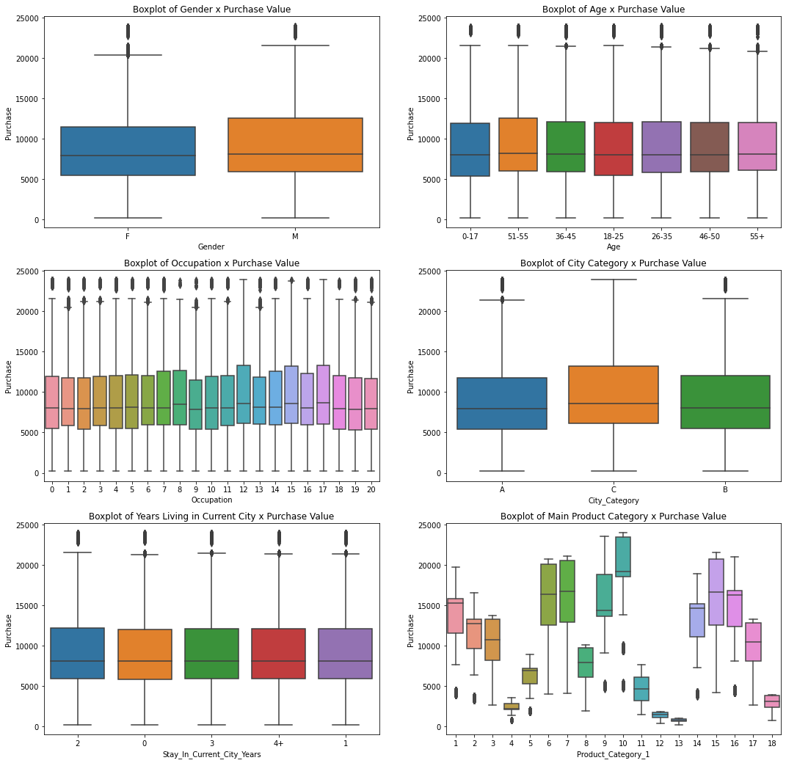

# 🔬 Exploratory Data Analysis: E-commerce sales during Black Friday

  <em>Exploratory Data Visual Analysis on Retail E-commercer Sales during Black Friday.</em>

 

    
    

## 📖 Project

### 👨🏻‍🏫 Introduction

Exploratory Data Analysis on a dataset containing Black Friday sales information of an retail e-commerce.

### 🎯 Goal

Produce and EDA restricted to **visual analysis tools**. The challenge is to produce insights only by visualization. The notebook explores a few questions:

- Does the marital status influences in the average purchase value?
- Does the marital status influences in the purchase category?
- If one wants to sell more products of category 14, should one invest more in publicity for marital status 0 or 1?
- Which variables are correlated to the value of the purchase?

### 📊 Chart Example

## 🗄 Notebooks

- [1.0-eda.ipynb](notebooks/1.0-eda.ipynb)

## 📈 Features

| Column                 | Description                                               |
|:-----------------------|:----------------------------------------------------------|
| User_ID                | User ID (key)                                             |
| Product_ID             | Product ID (key)                                          |
| Gender                 | User gender                                               |
| Age                    | Interval range of user age                                |
| Occupation             | Occupation (masked)                                       |
| City_Category          | City Size Category (A, B, C)                              |
| StayInCurrentCityYears | Number of Years the user is living in the current city    |
| Marital_Status         | Marital status (Single or Married)                        |
| Product_Category_1     | Product category (Masked)                                 |
| Product_Category_2     | A 2nd possible product category (Masked)                  |
| Product_Category_3     | A 3rd possible product category (Masked)                  |
| Purchase               | Purchase value                                            |

## 📦 Folder Structure

    ├── LICENSE
    ├── README.md          <- The top-level README for developers using this project.
    ├── data
    │   └── raw            <- The original, immutable data dump.
    │   ├── processed      <- The final, canonical data sets for modeling.
    │
    ├── notebooks          <- Jupyter notebooks. Naming convention is a number (for ordering),
    │                         and a short `-` delimited description, e.g.
    │                         `1.0--creating-the-model.ipynb`.
    ├── references         <- images, reports, and other resources for the project